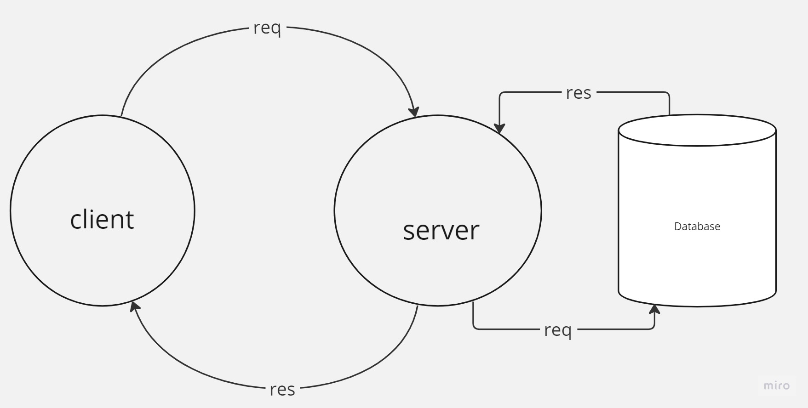

 
# Movies-Library - First Version

**Author Name**:Nadine Yaser Almasri

## WRRC

## Overview
explaining the role of the browser and the server as components of the web request-response cycle
## Getting Started
<!-- What are the steps that a user must take in order to build this app on their own machine and get it running? -->
* Create a repository called Movies-Library on GitHub
* Initialize your project by running the following command "npm  init -y"
* Create a new branch called Lab13
* Create basic file structure (server.js, .gitignore, .eslintrc.json )
* Install the required packages for this lab: npm install express 
* Build the requsting routes using the GET request:
## Project Features
<!-- What are the features included in you app -->
In this project we learnt :
* buliding routes
* handling server errors 
* handling the database 
## for lab 14 
* we learn Create GET request to the 3rd party API for endpoints.
* Get our API key
* learn the use of ( cros , .then , .use , sync ,async )
---
## Database Lab15:
Overview:

set up  database and read and save data to it.

---

## SQL Commands lab16:

### we started to understand INSERT, DELETE, UPDATE, and SELECT commands implementation on tables.
- INSERT INTO statement is used to insert data into a table.
- The UPDATE statement is used to modify the values in a table.
- DELETE statement is used to remove an entire record from the table.
- The SELECT statement is used to fetch data from the database.

#### We continue working on our Movies-Library repository. we  learn how to update and delete an entry in our database.
