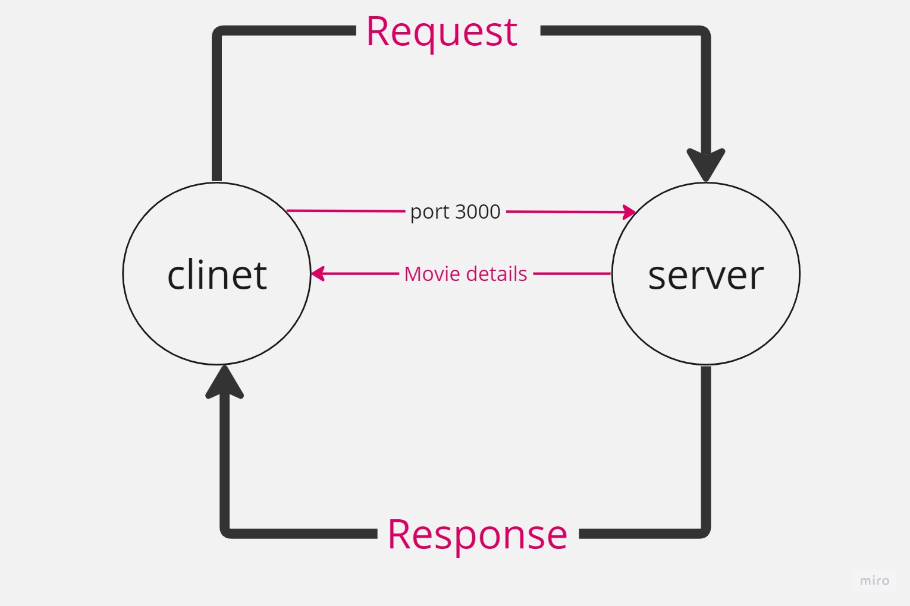

 
# Movies-Library - First Version

**Author Name**:Nadine Yaser Almasri

## WRRC

## Overview
explaining the role of the browser and the server as components of the web request-response cycle
## Getting Started
<!-- What are the steps that a user must take in order to build this app on their own machine and get it running? -->
* Create a repository called Movies-Library on GitHub
* Initialize your project by running the following command "npm  init -y"
* Create a new branch called Lab13
* Create basic file structure (server.js, .gitignore, .eslintrc.json )
* Install the required packages for this lab: npm install express 
* Build the requsting routes using the GET request:
## Project Features
<!-- What are the features included in you app -->
In this project we learnt :
* buliding routes
* handling server errors 
* handling the database 